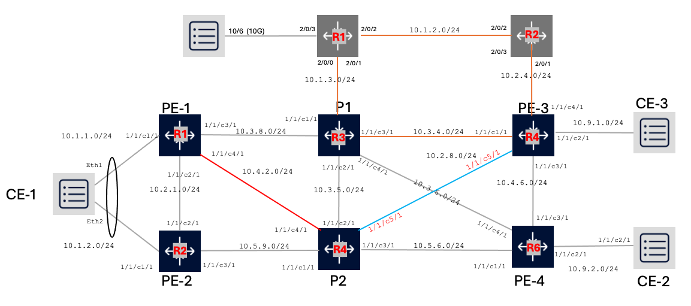

# REN Topology Project 

Author: Mohammad Zaman - mohammad.zaman@nokia.com

## Topology



## Deploy Lab

All the required configs and packags are pre-configured. Run the below command to bring up the lab

**VSIM(VM) SR vrnet**
```
sudo containerlab deploy -t sros_monitoring_topolgy.clab.yaml
```
**SR-SIM (native container) Based**

```
sudo containerlab deploy -t srsim-monitoring-topology.clab.yml
```

*Users should collect images and license files from their respective Vendor Representatives*

## Access Details:

| Node   | Username    | Password    |
|-------------|-------------|-------------|
| Nokia SROS | admin| admin|
| Traffic-Gen| root| password|
| Junos| admin| admin@123|
| Cisco| admin| admin|
| Grafana | http:<ip_address_local_machine>:3000 | At Browser: admin/admin|
| Prometheus | http:<ip_address_local_machine>:9090 | no login needed|
| Opensearch-Dashboard | http:<ip_address_local_machine>:5601 | At Browser admin/Nokia2018! (if prompoted, generally its open)|


Examples to login to node

```
ssh admin@pe1
```

Iperf Traffic can be generated from the CE1 Node towards CE3. 

```
ssh root@ce1 
```
Password: password

```
./start_traffic.sh
```

## Setup Details

1. There are 4 Provider Edge Nodes - PE - Nokia SROS connecting to 3-CE Linux Nodes through access SAP as shown in topology diagram.
2. All the nodes has been configured with L3 Interfaces, System Loopback Interfaces
	
	```
	A:pe1# show router interface

    ===============================================================================
    Interface Table (Router: Base)
    ===============================================================================
    Interface-Name                   Adm       Opr(v4/v6)  Mode    Port/SapId
    IP-Address                                                  PfxState
    -------------------------------------------------------------------------------
    system                           Up        Up/Down     Network system
    1.1.1.1/32                                                  n/a
    to-p1                            Up        Up/Down     Network 1/1/c3/1
    10.3.8.1/30                                                 n/a
    to-p2                            Up        Up/Down     Network 1/1/c4/1
    10.4.2.1/30                                                 n/a
    to-pe2                           Up        Up/Down     Network 1/1/c2/1
    10.2.1.1/30                                                 n/a
    -------------------------------------------------------------------------------
    Interfaces : 4
    ===============================================================================
	```

3. The Core network PE--P--PE Nodes have been configured with ISIS as IGP.

    ```
    A:pe1# show router isis adjacency

    ===============================================================================
    Rtr Base ISIS Instance 0 Adjacency
    ===============================================================================
    System ID                Usage State Hold Interface                     MT-ID
    -------------------------------------------------------------------------------
    p1                       L2    Up    26   to-p1                         0
    p2                       L2    Up    26   to-p2                         0
    pe2                      L2    Up    19   to-pe2                        0
    -------------------------------------------------------------------------------
    Adjacencies : 3
    ===============================================================================
    ```

4. The Core network PE--p--PE Nodes have been configured with Segment-Routing with ISIS.

    ```
    A:pe1# tools dump router segment-routing tunnel
    ===================================================================================================
    Legend: (B) - Backup Next-hop for Fast Re-Route
            (D) - Duplicate
    label stack is ordered from top-most to bottom-most
    ===================================================================================================
    --------------------------------------------------------------------------------------------------+
    Prefix                                                                                           |
    Sid-Type        Fwd-Type       In-Label  Prot-Inst(algoId)                                       |
                    Next Hop(s)                                     Out-Label(s) Interface/Tunnel-ID |
    --------------------------------------------------------------------------------------------------+
    1.1.1.1
    Node            Terminating    20001     ISIS-0
    5.5.5.5
    Node            Orig/Transit   20005     ISIS-0
                    10.3.8.2                                        20005       to-p1
    10.4.2.2
    Adjacency       Transit        524284    ISIS-0
                    10.4.2.2                                        3           to-p2
    10.3.8.2
    Adjacency       Transit        524285    ISIS-0
                    10.3.8.2                                        3           to-p1
    10.2.1.2
    Adjacency       Transit        524286    ISIS-0
                    10.2.1.2                                        3           to-pe2
    --------------------------------------------------------------------------------------------------+
    No. of Entries: 5
    --------------------------------------------------------------------------------------------------+
    ```

5.   L2 VPLS with service 10 wih Spoke SDPs have been configured

    ```
    A:pe1# show service id 10 base

    ===============================================================================
    Service Basic Information
    ===============================================================================
    Service Id        : 10                  Vpn Id            : 0
    Service Type      : VPLS
    MACSec enabled    : no
    Name              : 10
    Description       : L2 VPLS Service
    Customer Id       : 1                   Creation Origin   : manual
    Last Status Change: 11/07/2024 17:51:40
    Last Mgmt Change  : 11/07/2024 17:51:23
    Etree Mode        : Disabled
    Admin State       : Up                  Oper State        : Up
    MTU               : 1514
    SAP Count         : 1                   SDP Bind Count    : 1
    Snd Flush on Fail : Disabled            Host Conn Verify  : Disabled
    SHCV pol IPv4     : None
    Propagate MacFlush: Disabled            Per Svc Hashing   : Disabled
    Allow IP Intf Bind: Disabled
    Fwd-IPv4-Mcast-To*: Disabled            Fwd-IPv6-Mcast-To*: Disabled
    Mcast IPv6 scope  : mac-based
    Def. Gateway IP   : None
    Def. Gateway MAC  : None
    Temp Flood Time   : Disabled            Temp Flood        : Inactive
    Temp Flood Chg Cnt: 0
    SPI load-balance  : Disabled
    TEID load-balance : Disabled
    Lbl Eth/IP L4 TEID: Disabled
    Src Tep IP        : N/A
    Vxlan ECMP        : Disabled
    MPLS ECMP         : Disabled
    Ignore MTU Mismat*: Disabled
    Tunnel ELMI       : Disabled

    -------------------------------------------------------------------------------
    Service Access & Destination Points
    -------------------------------------------------------------------------------
    Identifier                               Type         AdmMTU  OprMTU  Adm  Opr
    -------------------------------------------------------------------------------
    sap:1/1/c1/1                             null         1514    1514    Up   Up
    sdp:3:10 S(5.5.5.5)                      Spok         0       9190    Up   Up
    ===============================================================================
    ```

## Traffic

The client1 and client2 are installed with iPerf packages. Users can designate client1 and client2 as server/client respectively and observe the traffic.

At Server Side

```
iperf3 -s
```

At Client Side

```
iperf3 -c 10.99.1.1
```

## Alerts and Notification at Grafana

The repo sets a sample port-utilization alert rule, However for notification you need to select the notification tool like discord/slask....
As sample follow the steps:

Select the dashbaord and on the left side under Alerts, Under admin, copy paste this blob with your discord key, or you can also fill the details under `contact points` which should be simple.

```
{
  "template_files": {},
  "template_file_provenances": {},
  "alertmanager_config": {
    "route": {
      "receiver": "discord-dallas-dc",
      "group_by": [
        "grafana_folder",
        "alertname"
      ]
    },
    "templates": null,
    "receivers": [
      {
        "name": "discord-dallas-dc",
        "grafana_managed_receiver_configs": [
          {
            "uid": "c3cefb62-a03e-4e42-9dad-9aebaccfcb9f",
            "name": "discord-dallas-dc",
            "type": "discord",
            "disableResolveMessage": false,
            "settings": {
              "url": "????????????????????????????? ADD your own Discord Webhook key in the quotes ######################## ",
              "use_discord_username": false
            },
            "secureFields": {}
          }
        ]
      }
    ]
  }
}
```
